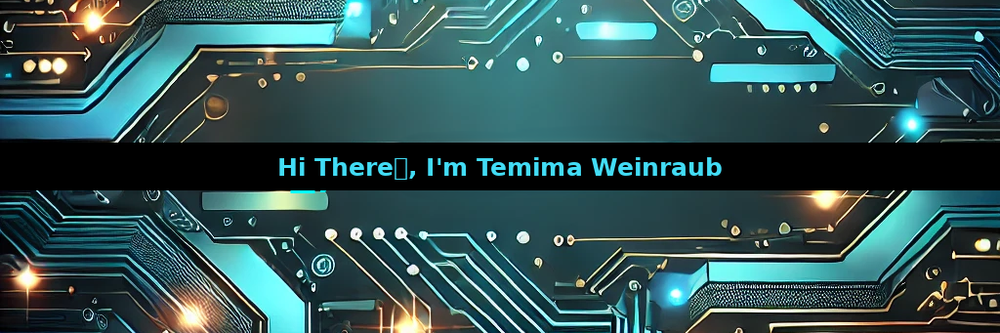

  
  <h1 style="position: absolute; top: 50%; left: 50%; transform: translate(-50%, -50%); color: #00d8ff; font-size: 2.5em; font-family: Arial, sans-serif; text-shadow: 2px 2px 4px rgba(0, 0, 0, 0.8);">
   
  </h1>

### Software Developer in Training
<!--
**TemimaW/TemimaW** is a ✨ _special_ ✨ repository because its `README.md` (this file) appears on your GitHub profile.

Here are some ideas to get you started:

- 🔭 I’m currently working on ...
- 🌱 I’m currently learning Python, C#
- 👯 I’m looking to collaborate on ...
- 🤔 I’m looking for help with ...
- 💬 Ask me about ...
- 📫 How to reach me: ...
- 😄 Pronouns: ...
- ⚡ Fun fact: ...
-->
🌱 I’m currently learning Python, C#, Database, and Data Structures

⚡ Fun fact: Some of my hobbies are: music, art, and baking

